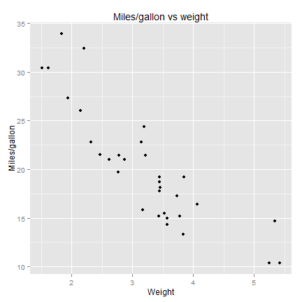

## For car buyers!

Want to buy a car which doesn't consume too much?

Which attributes of cars to look at?

Be cautious of car sellers, instead:

Use [Miles per gallon](http://halvorsardin.shinyapps.io/App-project/) application!


--- .class #id 

I want a big, heavy car which not consume too much!


```r
require(ggplot2)
require(datasets)
data(mtcars)
qplot(wt, mpg, data=mtcars, main="Miles/gallon vs weight",
      xlab="Weight", ylab="Miles/gallon")
```

 

--- .class #id
Super, but I knew that! What's more important I want a car with manual transmission which consume not too much.


```r
mtcars$am = factor(mtcars$am, levels=c(0, 1), labels=c("automatic", "manual"))
qplot(am, mpg, data=mtcars, geom="boxplot",
      main="Miles/gallon vs Transmission",
      xlab="Transmission", ylab="Miles/gallon")
```

 


--- .class #id

:( Ok. But there should be a big number of forward gears, because I like it!


```r
mtcars$gear = factor(mtcars$gear, levels=c(3, 4, 5), labels=c("3 forward gears", "4 forward gears","5 forward gears" ))
qplot(gear, mpg, data=mtcars, geom="boxplot",
      main="Miles/gallon vs Gears",
      xlab="Number of forward gears", ylab="Miles/gallon")
```

 


--- .class #id

## Sources


1. [Mtcars](http://stat.ethz.ch/R-manual/R-devel/library/datasets/html/mtcars.html) dataset is built in R
2. Source: 1974 [Motor Trend](http://www.motortrend.com/) US magazine
3. Explore more car attributes:
4. [http://halvorsardin.shinyapps.io/App-project/](http://halvorsardin.shinyapps.io/App-project/)
 


